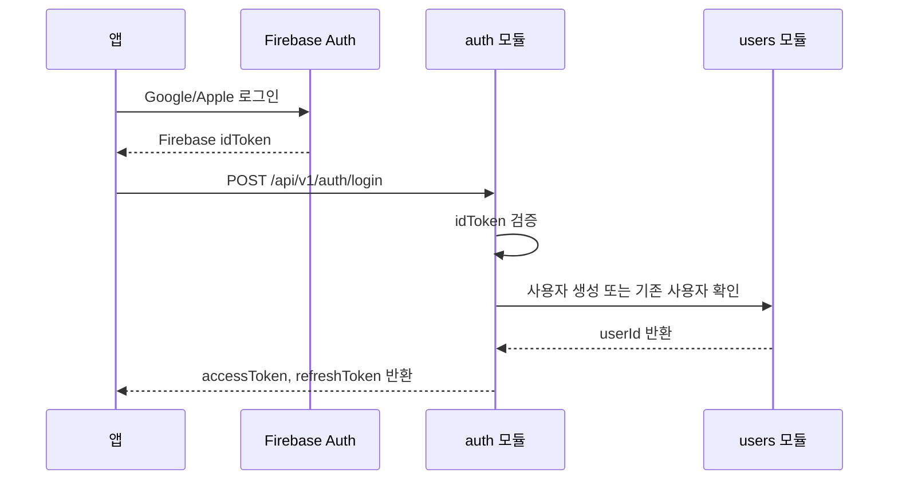
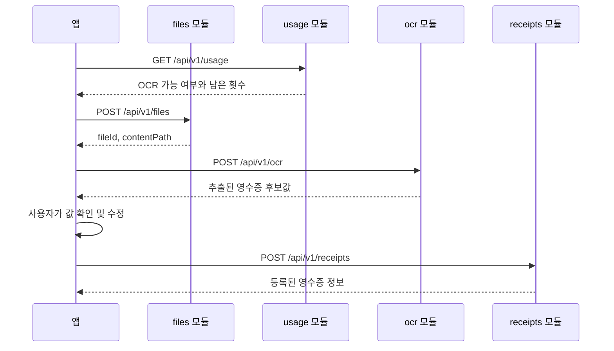
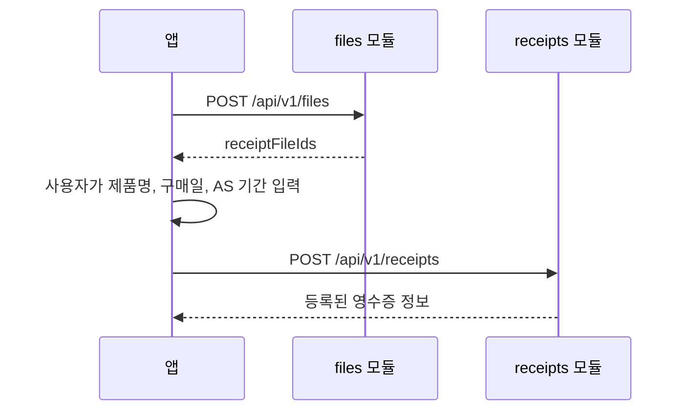
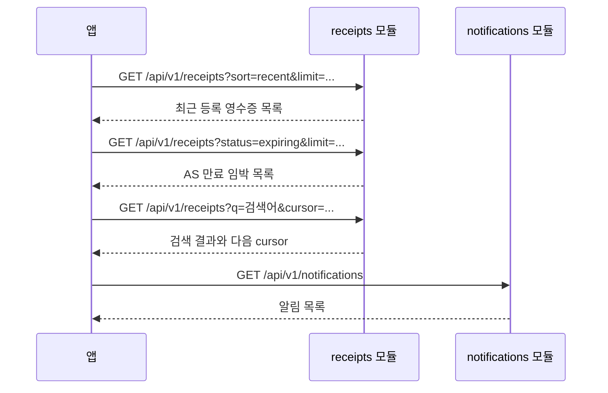
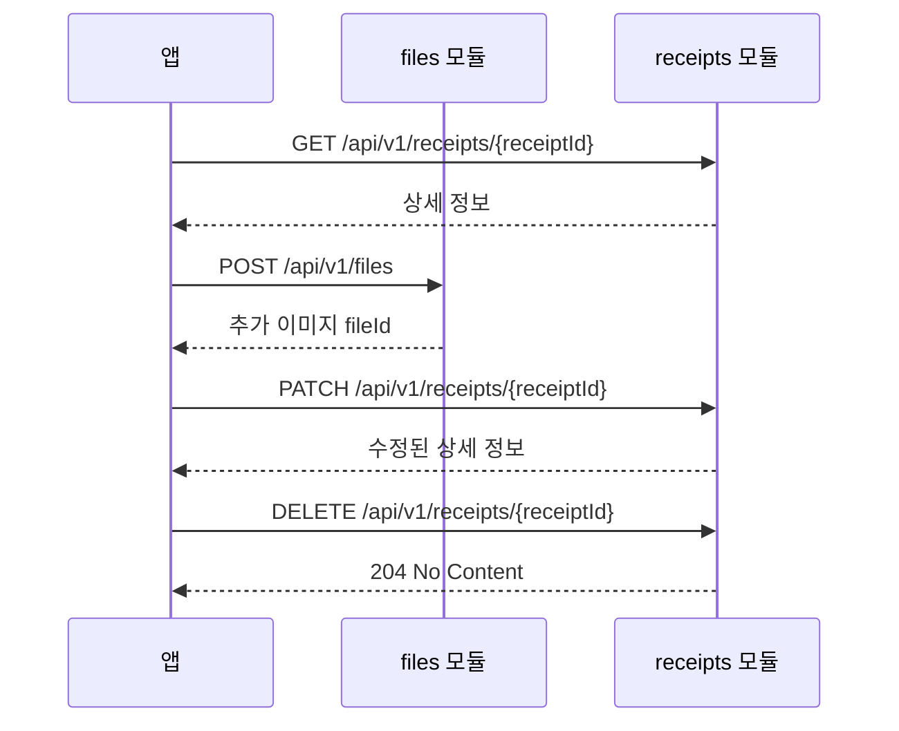
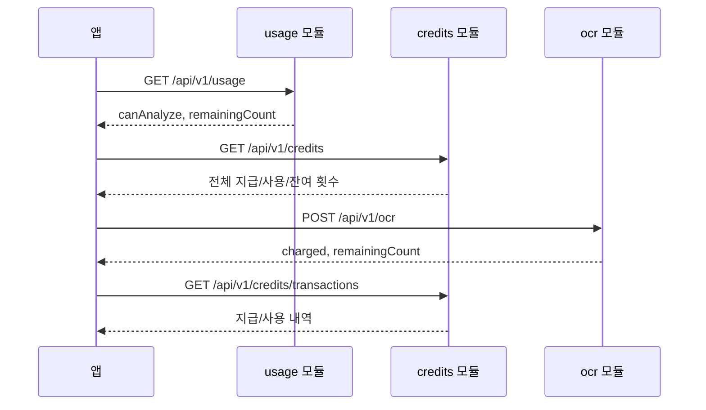
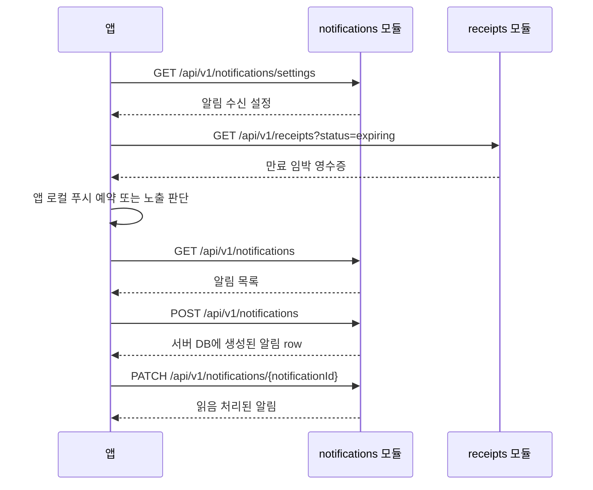

# MVP API 설계 방향 및 모듈별 기능 명세

작성일: 2026-06-28

이 문서는 MVP 기준 API 설계 방향, 모듈별 기능 책임, 앱 요청 후 백엔드 처리 흐름을 정리한다. 현재 구현은 앱 개발자가 화면 연동을 먼저 진행할 수 있도록 일부 API에서 mock 응답을 사용한다.

## 설계 원칙

- API 경로는 화면명이 아니라 리소스 기준으로 둔다. 예: `/home` 대신 `/receipts`, `/notifications`, `/usage`.
- MVP는 영수증 중심 서비스로 본다. `assets`, `warranties` BC는 이번 MVP에 도입하지 않고, 영수증으로부터 제품명/구매일/무상 AS 만료일을 조회한다.
- 영수증 이미지는 `files`에서 먼저 업로드하고, 영수증 등록/수정 시 `receiptFileIds`로 연결한다.
- 저장된 영수증은 첨부 이미지가 최소 1장, 최대 5장이어야 한다.
- `credits`와 `usage`는 분리한다. `credits`는 지급/사용 내역과 잔여 횟수, `usage`는 앱이 지금 기능을 사용할 수 있는지 보는 스냅샷이다.
- 알림은 FCM token이나 device-token을 서버에 저장하지 않는다. 앱이 목록/상태/설정을 API로 조회하고, 만료 임박 등 로컬 푸시가 가능한 조건은 앱에서 처리한다.
- 공개 응답은 `CommonResponse` 봉투를 사용하고, 앱 계약은 camelCase 필드명을 기본으로 한다.

## 모듈별 책임

| 모듈 | 책임 | 앱에서 보는 주요 화면/기능 | 현재 상태 |
|---|---|---|---|
| `auth` | Firebase 로그인 결과를 백엔드 세션과 토큰으로 교환한다. | 소셜 로그인, 토큰 갱신, 로그아웃 | 실제 use case |
| `users` | 로그인한 사용자의 프로필과 계정 탈퇴를 담당한다. | 마이페이지, 프로필 이미지 설정, 회원 탈퇴 | 실제 use case |
| `files` | 이미지 업로드, 파일 정보 조회, 원본 다운로드, 삭제를 담당한다. | 영수증 이미지 업로드, 프로필 이미지 업로드, 이미지 표시 | 실제 use case |
| `ocr` | 업로드된 영수증 이미지에서 등록 후보값을 추출한다. | 영수증 분석 화면 | local/test 부분 mock, OpenRouter key 설정 시 외부 OCR |
| `receipts` | 영수증 등록 데이터와 무상 AS 조회 데이터를 담당한다. | 홈 최근 등록, 목록, 검색, 상세, 수정, 삭제 | 등록은 실제 use case, 조회/수정/삭제는 mock |
| `credits` | OCR 분석에 쓸 수 있는 지급/사용 횟수와 내역을 담당한다. | 크레딧 잔여 횟수, 지급/사용 내역 | mock |
| `usage` | 기능별 사용 가능 여부를 앱이 빠르게 판단할 수 있게 제공한다. | OCR 버튼 활성화, 잔여 분석 횟수 표시 | mock |
| `notifications` | 알림 목록, 알림 생성, 읽음 상태, 알림 설정을 담당한다. | 알림 목록, 마이페이지 알림 설정 | persistence-backed 실제 use case |

## API 기능 명세

| 모듈 | Method | Endpoint | 기능 설명 | 앱 호출 시점 | 현재 응답 |
|---|---:|---|---|---|---|
| auth | POST | `/api/v1/auth/login` | Firebase `idToken`으로 백엔드 access token과 refresh token을 발급한다. 신규 사용자는 약관/개인정보 동의값도 함께 보낸다. | Google/Apple 로그인 성공 직후 | 실제 use case |
| auth | POST | `/api/v1/auth/refresh` | refresh token으로 새 access token과 refresh token을 발급한다. | access token 만료 또는 401 응답 수신 후 | 실제 use case |
| auth | POST | `/api/v1/auth/logout` | refresh token을 무효화한다. | 로그아웃 확정 시 | 실제 use case |
| users | GET | `/api/v1/users/me` | 로그인한 사용자의 이메일, 이름, 닉네임, 프로필 이미지 경로를 반환한다. | 앱 초기 진입, 마이페이지 진입 | 실제 use case |
| users | PUT | `/api/v1/users/me/profile-image` | 업로드된 파일을 내 프로필 이미지로 설정한다. | 프로필 이미지 변경 저장 시 | 실제 use case |
| users | DELETE | `/api/v1/users/me/profile-image` | 내 프로필 이미지를 제거한다. | 기본 프로필로 되돌릴 때 | 실제 use case |
| users | DELETE | `/api/v1/users/me` | 내 계정을 탈퇴 처리한다. | 회원 탈퇴 확정 시 | 실제 use case |
| files | POST | `/api/v1/files` | 이미지 파일을 1개 이상 업로드하고 파일 ID와 다운로드 경로를 반환한다. | 영수증 OCR 전, 영수증 첨부 이미지 추가 전, 프로필 이미지 설정 전 | 실제 use case |
| files | GET | `/api/v1/files/{file_id}` | 업로드 파일의 이름, 형식, 크기, 다운로드 경로를 조회한다. | 파일 ID만 있고 표시 정보가 필요할 때 | 실제 use case |
| files | GET | `/api/v1/files/{file_id}/content` | 업로드 파일 원본을 다운로드한다. | 앱에서 실제 이미지를 렌더링할 때 | 실제 use case |
| files | DELETE | `/api/v1/files/{file_id}` | 아직 영수증에 연결하지 않은 파일을 삭제한다. | 업로드 후 등록하지 않고 제거할 때 | 실제 use case |
| ocr | POST | `/api/v1/ocr` | 영수증 이미지에서 제품명, 브랜드, 구매처, 구매일, 금액, 무상 AS 기간, 카테고리 후보를 추출한다. | 사용자가 이미지를 선택하고 “영수증 분석 시작”을 누를 때 | 부분 mock |
| receipts | GET | `/api/v1/receipts` | 영수증 목록을 조회한다. 상태, 카테고리, 검색어, 정렬, 커서 페이징을 지원한다. | 목록 탭, 검색 결과, 홈 최근 등록 리스트, AS 만료 임박 리스트 | mock |
| receipts | POST | `/api/v1/receipts` | OCR 결과를 사용자가 수정한 값 또는 수동 입력값으로 영수증을 등록한다. | OCR 결과 확인 후 등록, 수동 입력 완료 후 등록 | 실제 use case |
| receipts | GET | `/api/v1/receipts/{receipt_id}` | 영수증 상세 정보를 조회한다. 제품 정보, 구매 정보, 무상 AS 정보, 첨부 이미지를 포함한다. | 목록/검색/홈에서 상세 화면 진입 시 | mock |
| receipts | PATCH | `/api/v1/receipts/{receipt_id}` | 영수증 정보와 첨부 이미지 목록을 수정한다. 수정 후에도 이미지는 1장 이상 5장 이하여야 한다. | 상세 화면에서 수정 저장 시 | mock |
| receipts | DELETE | `/api/v1/receipts/{receipt_id}` | 영수증을 삭제한다. 연결 해제된 파일의 실제 스토리지 정리는 별도 파일 정리 작업에서 처리한다. | 상세/목록에서 삭제 확정 시 | mock |
| credits | GET | `/api/v1/credits` | 지금까지 받은 횟수, 사용한 횟수, 남은 횟수를 반환한다. | 홈/분석 화면에서 잔여 횟수를 보여줄 때 | mock |
| credits | GET | `/api/v1/credits/transactions` | 퀴즈 보상, OCR 사용처럼 크레딧이 추가되거나 사용된 내역을 조회한다. | 크레딧 내역 화면 진입 시 | mock |
| usage | GET | `/api/v1/usage` | 기능별 사용 가능 여부와 남은 횟수를 반환한다. | OCR 버튼 활성화 여부, “잔여 3회” UI 표시 전 | mock |
| notifications | GET | `/api/v1/notifications` | 보증 만료, 영수증 등록 안내, 혜택 안내 등 앱 알림 목록을 조회한다. | 알림 화면 진입 시 | persistence-backed 실제 use case |
| notifications | POST | `/api/v1/notifications` | 현재 사용자에게 표시할 알림 행을 서버 DB에 생성한다. 푸시 발송이나 외부 전달은 수행하지 않는다. | 서버에 저장된 앱 알림 row가 필요할 때 | persistence-backed 실제 use case |
| notifications | GET | `/api/v1/notifications/settings` | 푸시 알림과 마케팅 알림 수신 설정을 조회한다. | 마이페이지 알림 설정 화면 진입 시 | persistence-backed 실제 use case |
| notifications | PATCH | `/api/v1/notifications/settings` | 푸시 알림과 마케팅 알림 수신 설정을 수정한다. 보내지 않은 값은 유지한다. | 설정 화면 토글 변경 시 | persistence-backed 실제 use case |
| notifications | PATCH | `/api/v1/notifications/{notification_id}` | 알림을 읽은 상태로 변경하고 변경된 알림 정보를 반환한다. | 알림 항목 클릭 또는 읽음 처리 시 | persistence-backed 실제 use case |

## 앱 요청 후 기능 동작 파이프라인

### 공통 인증 흐름

앱은 이후 보호 API 호출마다 `Authorization: Bearer <accessToken>`을 보낸다. access token이 만료되면 `/api/v1/auth/refresh`로 재발급한다.

### 영수증 OCR 등록 흐름

OCR이 실패하면 앱은 수동 입력 화면으로 이동할 수 있다. OCR 결과를 받고 등록 전에 이탈하면 데이터는 저장되지 않는다.

### 수동 영수증 등록 흐름

수동 등록도 저장되는 영수증에는 첨부 이미지가 최소 1장 필요하다.

### 홈, 목록, 검색 흐름

홈 화면과 목록 화면은 같은 `/receipts` 리소스를 다른 조건으로 호출한다. 별도 `/home` API를 만들지 않는다.

### 영수증 상세, 수정, 삭제 흐름

이미지 수정은 파일 자체를 `receipts`에 직접 업로드하는 방식이 아니다. 앱은 먼저 `files`에 업로드하고, 영수증 수정 요청에서 최종 `receiptFileIds` 목록을 보낸다.

### 크레딧과 사용 가능 여부 흐름

앱은 버튼 활성화처럼 즉시 필요한 판단에는 `usage`를 사용한다. 사용자가 “왜 남은 횟수가 이렇게 됐는지” 확인해야 하는 화면에서는 `credits`와 `credits/transactions`를 사용한다.

### 알림 흐름

`POST /api/v1/notifications`는 서버에 표시용 알림 행을 저장하는 API다. 서버는 FCM token/device-token 등록 API와 서버 푸시 발송 경로를 제공하지 않는다. 앱은 서버 조회 결과와 로컬 알림 정책을 조합해 푸시 노출을 결정한다.

## 페이징과 목록 요청

목록형 API는 커서 기반 페이징을 사용한다.

| API | 페이징 필드 | 주요 필터 |
|---|---|---|
| `GET /api/v1/receipts` | `cursor`, `limit`, `pagination.nextCursor`, `pagination.hasNext` | `status`, `sort`, `category`, `q` |
| `GET /api/v1/credits/transactions` | `cursor`, `limit`, `pagination.nextCursor`, `pagination.hasNext` | 없음 |
| `GET /api/v1/notifications` | `cursor`, `limit`, `pagination.nextCursor`, `pagination.hasNext` | 없음 |

앱은 첫 요청에 `cursor`를 보내지 않고, 다음 페이지가 필요할 때 이전 응답의 `pagination.nextCursor`를 그대로 보낸다.

## 후속 구현 경계

- 현재 mock API는 앱 화면 연동 계약을 먼저 맞추기 위한 것이다.
- `receipts` 조회/수정/삭제, `credits`, `usage`의 실제 persistence는 application/infra 작업에서 별도로 구현한다.
- `assets`, `warranties`, 결제/billing, 서버 FCM token/device-token 관리와 서버 푸시 발송은 MVP 범위 밖이다.
- 영수증 삭제 후 연결 해제된 파일의 물리 삭제는 즉시 삭제가 아니라 파일 정리 정책에서 다룬다.
